# WBABEProject-05

# 띵동주문이요, 온라인 주문 시스템(Online Ordering System)

|         | 내용                                                    |
|---------|-------------------------------------------------------|
| 프로젝트 제목 | 띵동주문이요, 온라인 주문 시스템(Online Ordering System)            |
| 소요시간    | 3 ~ 5일                                                |
| 난이도     | 보통                                                    |
| 기술스택    | Golang, Gin Framework, RESTful, MVC패턴, MongoDB, Query |

---

## 요구사항
- gin-gonic framework를 사용하여 온라인 주문 시스템 API Server를 개발합니다.
- 온라인 주문 시스템에 관련한 데이터베이스 document를 직접 설계합니다.
- 주문자, 피주문자 CRUD API를 개발합니다.
- mongodb와 연동하여 실제 데이터베이스에 데이터가 저장될 수 있게 합니다.
- 디버깅을 위한 로그 출력이 가능하게 구성합니다.
- 스웨거를 이용해 API 문서화를 합니다.
- toml을 이용해 설정 파일을 구성합니다.


### 메뉴 신규 등록  - 피주문자

- **API |** 신규 메뉴 등록
    - 사업장에서 신규 메뉴 관련 정보를 등록하는 과정(ex. 메뉴 이름, 주문가능여부, 한정수량,  원산지, 가격, 맵기정도, etc)
    - 성공 여부를 리턴

### 메뉴 수정 / 삭제 - 피주문자

- **API |** 기존 메뉴 수정/삭제
    - 사업장에서 기존의 메뉴 정보 변경기능(ex. 가격변경, 원산지 변경, soldout)
    - 메뉴 삭제시, 실제 데이터 백업이나 뷰플래그를 이용한 안보임 처리
    - 금일 추천 메뉴 설정 변경, 리스트 출력
    - 성공 여부를 리턴

### 메뉴 리스트 출력 조회 - 주문자

- **API |** 메뉴 리스트 조회 및 정렬(추천/평점/주문수/최신)
    - 각 카테고리별  sort 리스트 출력(ex. order by 추천, 평점, 재주문수, 최신)
    - 결과 5~10여개 임의 생성 출력, sorting 여부 확인

### 메뉴별 평점 및 리뷰 조회 - 주문자

- **API |** 개별 메뉴별 평점 및 리뷰 보기
    - UI에서 메뉴 리스트에서 상기 리스트 출력에 따라 개별 메뉴를 선택했다고 가정
    - 해당 메뉴 선택시 메뉴에 따른 평점 및 리뷰 데이터 리턴

### 메뉴별 평점 작성 - 주문자

- **API |** 과거 주문 내역 중, 평점 및 리뷰 작성
    - 해당 주문내역을 기준, 평점 정보, 리뷰 스트링을 입력받아 과거 주문내역 업데이트 저장
    - 성공 여부 리턴

### 주문 - 주문자

- **API |** UI에서 메뉴 리스트에서 해당 메뉴 선택, 주문 요청 및 초기상태 저장
    - 주문정보를 입력받아 주문 저장(ex. 선택 메뉴 정보, 전화번호, 주소등 정보를 입력받아 DB 저장)
    - 주문 내역 초기상태 저장
    - 금일 주문 받은 일련번호-주문번호 리턴

### 주문 변경 - 주문자

- **API |** 메뉴 변경 및 추가
    - 메뉴 추가시 상태조회 후 `배달중`일 경우 실패 알림
        - 성공 실패 알림, 실패시 신규주문으로 전환
    - 메뉴 변경시 상태가 `조리중`, `배달중`일 경우 확인
        - 성공 실패 알림

### 주문 내역 조회 - 주문자

- **API |** 주문내역 조회
    - 현재 주문내역 리스트 및 상태 조회 - 하기 **주문 상태 조회**에서도 사용
        - ex. 접수중/조리중/배달중 etc
        - 없으면 null 리턴
    - 과거 주문내역 리스트 최신순으로 출력
        - 없으면 null 리턴

### 주문 상태 조회 - 피주문자

- **API |** 현재 주문내역 리스트 조회
- **API |** 각 메뉴별 상태 변경
    - ex. 상태 : 접수중/접수취소/추가접수/접수-조리중/배달중/배달완료 등을 이용 상태 저장
    - 각 단계별 사업장에서 상태 업데이트
        - **접수중 → 접수** or **접수취소 → 조리중** or **추가주문 → 배달중**
        - 성공여부 리턴


---

### 프로젝트 구성

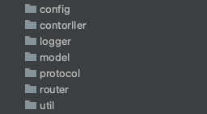

- toml 파일 및 프로젝트 config 관련 사항은 config 폴더를 이용할 것이다.
- mvc 패턴을 활용하기에 controller 와 model 패키지를 만들었다.
- protocol 은 request 또는 response 로 내려줄 data struct 들을 넣을 것이다.
- util 패키지는 flag 및 범용적으로 사용하게될 사항들을 넣어주자.
- logger 관련사항은 logger 패키지에 넣어주자.
- router 와 관련된 사항은 router 패키지에서 다룰 것이다.
- 조금 더 유연한 프로그램을 위해 controller 계층과 model 계층사이에 service 계층을 추가할 것이다.

### git-branch 전략

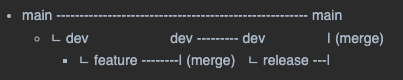

- 최종 main 브랜치에 merge 후 dev 브랜치는 main 브랜치와 싱크를 맞추기 위해 main 브랜치를 merge 한다.
- 위의 싸이클을 반복하며 개발한다.
- release 는 지금처럼 배포전 1차 개발단계에서는 생략하기도한다. 그러나 이 프로젝트에서는 생략하지 않기로 한다.


### naming 전략

- 인터페이스는 `~er`을 붙이고 구현체에는 붙이지 않는다.
- `.go` 파일은 두 단어 이상일 때 케밥케이스를 사용한다.
    - `ex) person_router.go`
- 코드는 카멜케이스를 원칙으로 한다.
    - `ex) personRouter`
- go의 `private`, `public` 네이밍을 기본으로 한다.
- 상수가 아닌이상 첫 글자는 소문자로 한다.
- 전역변수는 의미가 드러나게 작성하고 약어를 사용하지 않는다.
- 지역변수는 가능한한 약어로 하고, 리시버는 단어의 앞글자만을 사용한다.
- 만약 지역변수의 생존기간이 길어 코드의 가독성을 해치거나, 의미가 드러나야 한다면 약어를 사용하지 않는다.
- 메서드 이름은 최대한 의도가 드러나게 작성하자
- Golang 에서 두문자어는 대문자로 작성한다. ex) Database => DB
    - ex)
  ```go
    func (r *router) NewRouter(ctl Controller){
        n := ctl.Name
        ...
    }
    func (pr *PersonRouter) validatePerson(){
        pr.validate()
        ...
    }
    ```

# Docker 를 이용한 MongoDB 설치

- ~~docker-compose-singlersdb.yml 파일을 이용해 mongoDB를 설치하자.~~
- ~~여기서 우선 mongoDB의 replication 옵션을 이용할 것이다.~~
- ~~replication 옵션을 이용하는 이유는 트랜젝션을 이용하게될지도 모르기 떄문이다.~~
- ~~트랜젝션은 mongoDB 를 standalone 상태로 구동하면 실행되지 않는다.~~
- ~~우선 트랜젝션을 mongoDB 에서는 권장하지 않기에 최대한 트랜젝션을 사용하지 않는 구조로 설계하겠지만 개발은 항상 유연해야하기에 가능성을 열어두는 측면에서 replication 옵션을 사용한다.
  다음의 명령어들을 실행시키자.~~
```bash
$ docker-compose -f docker-compose-singlersdb.yml up -d
$ docker exec -it mongo-singlers /bin/bash
$ mongosh 127.0.0.1:27017/
test> rs.initiate()
```
- ~~몽고DB 접속 URI :
  `mongodb://127.0.0.1:27017/?directConnection=true&serverSelectionTimeoutMS=2000&appName=mongosh+1.6.1`~~


## 실행환경의 편의를 위해 replica 를 사용한 MongoDB 가 아닌 standalone 형태의 일반적인 MongoDB로 전환했다.
- MongoDB 에 지향점에 맞춰 트랜잭션을 사용하지 않았다.
- 다음과 같이 docker-compose 파일을 실행하자
```bash
$ docker-compose up -d 
```
- 몽고DB 접속 URI :
  `mongodb://127.0.0.1:27017`


### API 

GET    /home/info       


POST   /app/v1/users/user         
GET    /app/v1/users/user         
PUT    /app/v1/users/user         
DELETE /app/v1/users/user    


GET    /app/v1/stores             
GET    /app/v1/stores/store       
POST   /app/v1/stores/store       
PUT    /app/v1/stores/store      
GET    /app/v1/stores/store/recommends   
GET    /app/v1/stores/store/menus  
POST   /app/v1/stores/store/menus/menu    
PUT    /app/v1/stores/store/menus/menu    
DELETE /app/v1/stores/store/menus/menu   


GET    /app/v1/orders/pages/store   
GET    /app/v1/orders/pages/customer    
POST   /app/v1/orders/order      
GET    /app/v1/orders/order      
PUT    /app/v1/orders/order/customer   
PUT    /app/v1/orders/order/store   
GET    /app/v1/orders/order/price


POST   /app/v1/reviews/review    
GET    /app/v1/reviews/menu      
GET    /app/v1/reviews/customer


## 느낀점

#### 아쉬운점

- ~~몽고DB로 원하는 데이터를 뽑고 가공하는게 쉽지않다... 생각보다 더 쉽지 않아서 시간이 많이 소요되었다.~~
- ~~entity 설계만 끝나면 전체적인 도메인 구성과 쿼리는 어렵지 않을것이라 생각했는데..~~
- ~~정규화와 트랜젝션을 지양한다는 점에서 설계에 고민을 많이하기도 했고, 오히려 고민을 하다보니 더 복잡해진것 같기도하고, 무엇보다 mongo 쿼리가 처음 써보는거다보니 상당히 쉽지 않다.~~
- ~~익숙하지 않아 오래걸리다보니, 확장성이 뛰어난 몽고DB 이니까 처음엔 그냥 RDBMS 와 비슷한 구조로 가져가고 필요하다면 그냥 트랜잭션을 사용했어야 했나 싶다.~~
- ~~jwt, 단위 test, 프로젝트에 대한 이미지 작업, 기술 정리 등 적용하고 싶은게 많았지만.. 조금 아쉽다..~~
- 어찌저찌 기능 구현을 다 해냈다. 물론 아직 validation 처리를 해야하고, 추가적으로 하고싶은것들이 남았지만 일단 필요한 API 는 다 만들었다.
- 처음에 Document 지향으로 최대한 해보려고 하였으나, MongoDB의 Document 데이터를 가공해서 가져오기가 쉽지않았다. 떄문에 RDBMS 방식처럼 _id 를 활용하였다. 
- 참고 : [리모델링](https://github.com/codestates/WBABEProject-05/issues/23)
- 남은것 :   
[validation](https://github.com/codestates/WBABEProject-05/issues/26)     
[인증인가](https://github.com/codestates/WBABEProject-05/issues/27)


#### 좋았던점
- 그래도 이번 프로젝트로 그동안 커리큘럼을 진행하면서 `Golang 에서는 어떻게 객체지향적으로 코드를 작성할 수 있을까?` 를 수 없이 고민했었는데 이번에 나름 만족할만한 구조로 개발을 했다.
- 각 계층은 의존성을 최소화하기 위해 interface 를 통해 소통을 하도록 DIP 지킬 수 있도록 작성했다. 이는 나중에 쉽게 구현로직을 변경할 수 있게 해준다. 변경된 Dependency 를 inject 해줘야 하기에 완벽한 OCP 는 아니겠지만
  초기에 Dependency 를 inject 받은 interface 를 Public 하게 열고 사용하여 최대한 OCP 가 이루어지도록 하였다. 이로써 사용하는 계층은 확장에는 열려있고 변경에는 닫혀있게 된다.
- 또한 각 구현체는 싱글톤으로 사용되도록 구현했으며, 좀 더 SRP 에 가깝도록 구현로직과 생산로직을 분리, 각 계층에 Dependency 를 Inject 해주는 manager 를 두었다.
- 그동안 main 메서드에 많은 로직이 들어가는 것 같아 불편했는데 이 부분도 init() 메서드와 app struct 를 활용해 깔끔하게 만들었고, main.go 파일 안에서 전체 프로젝트 코드들의 구성이 한눈에 드러날 수 있도록 했다.
- golang 은 상속이 안돼, 가끔 재상용의 불편을 느꼈는데, composite 패턴과 앞서 말한 Dependency 를 inject 받은 interface Public 하게 열어두어 재사용이 용이하게 하였다.
- 좀 더 개선사항들이 보여 이 부분도 시간을 더 갖고 싶지만.. 이점은 조금 아쉽지만,
- 그래도 어떤식으로 `Golang 에서 객체지향을 녹이면 좋을지 이번 프로젝트를 통해 어느정도 느끼고 꺠달은것 같아 재밌는 프로젝트였다.`


### Swagger 전체
- http://localhost:8080/swagger/index.html#/

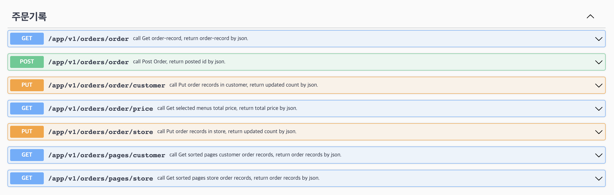

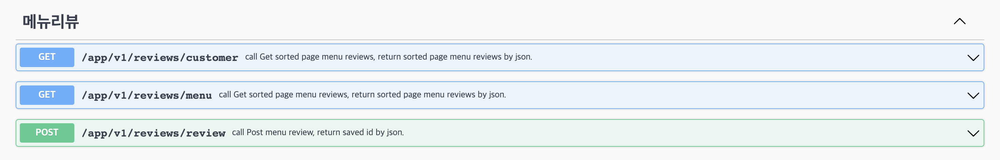

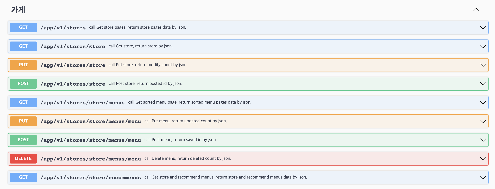

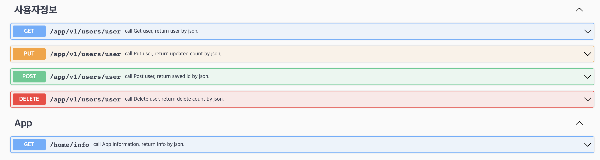


## UseCase 로 보는 Swagger 

- 추가적으로 아래 이미지들을 보면 페이지관련 query string 은 편의상 빈값으로 요청을 보냈는데, 서버에서 빈 값으로 요청이 오면 첫페이지 5개씩 최신순으로 기본값 처리한다.

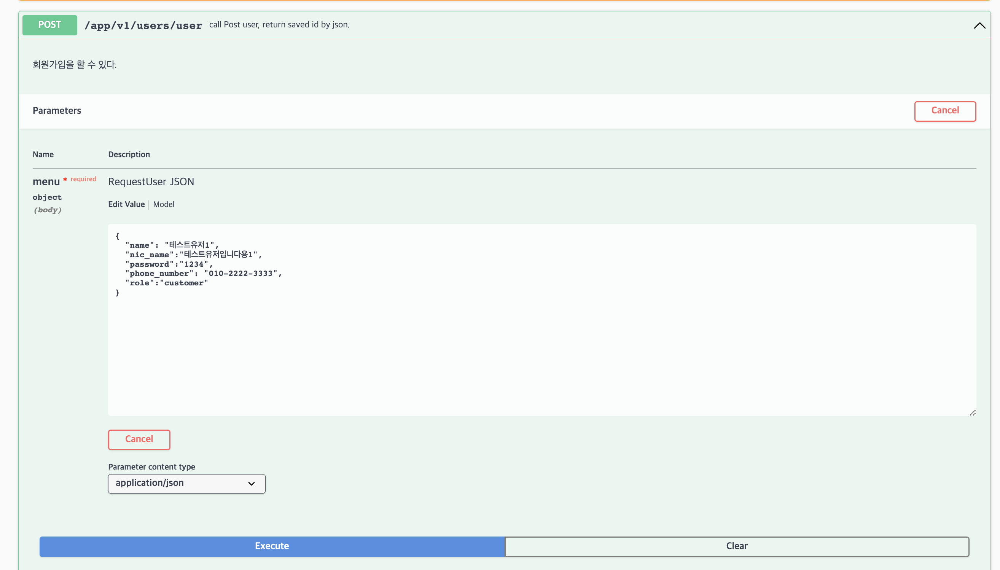


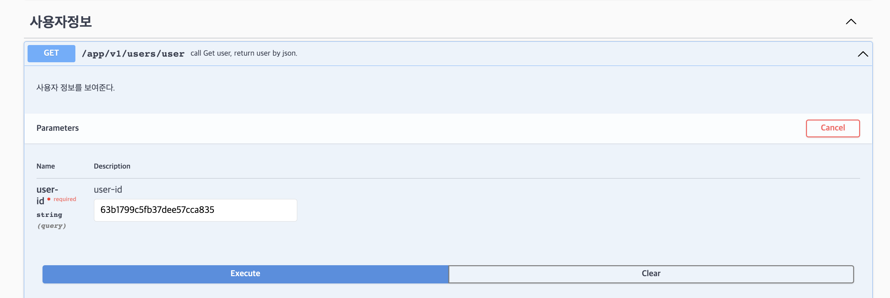

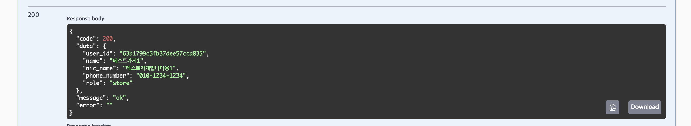

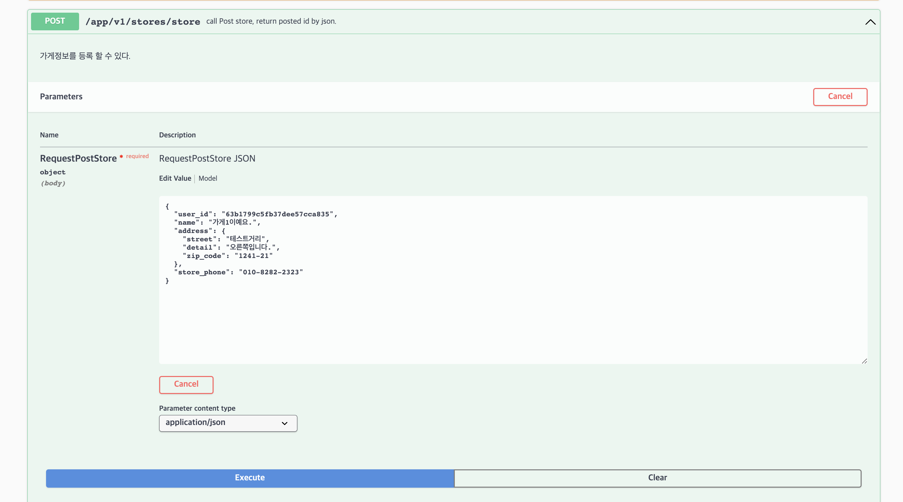

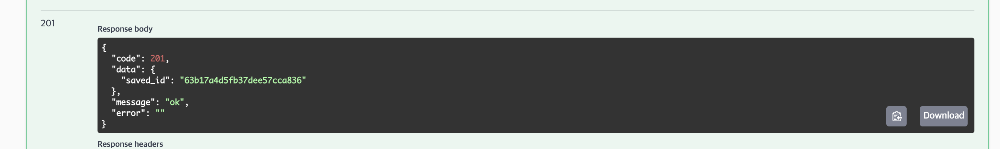


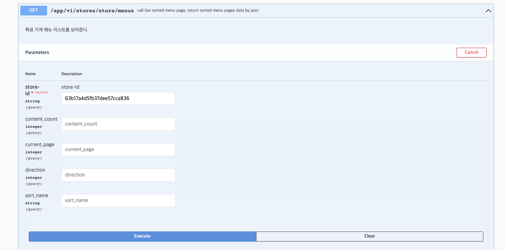

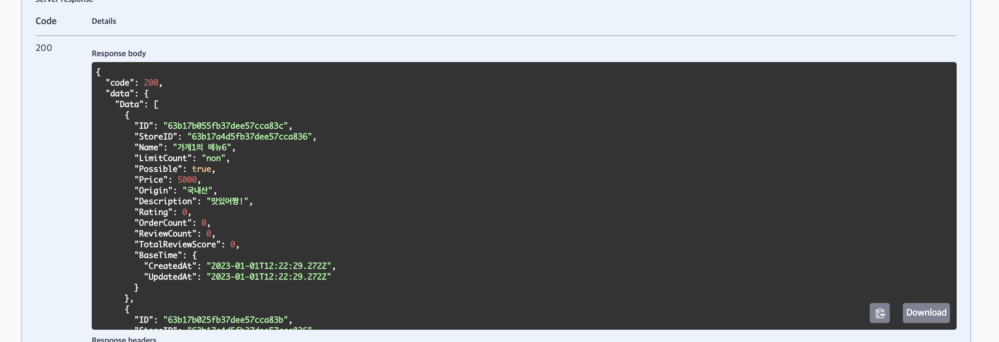

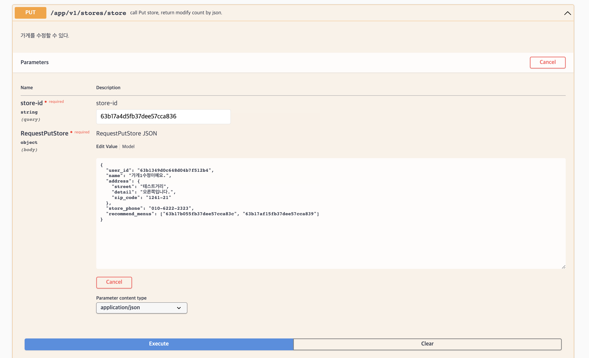

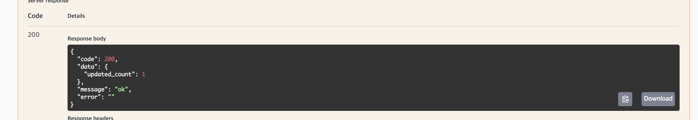

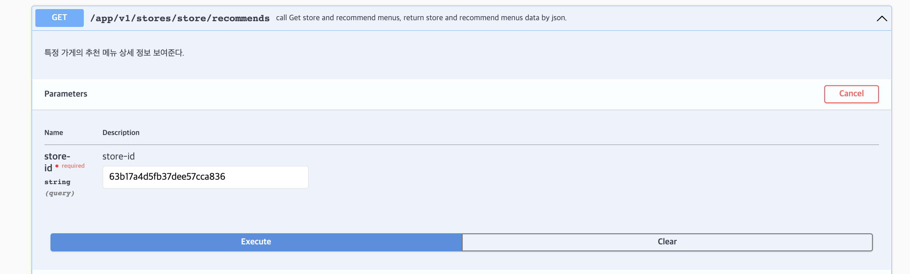

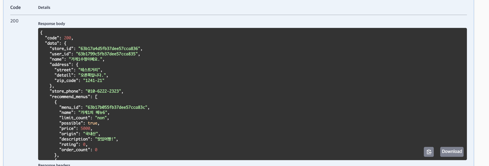

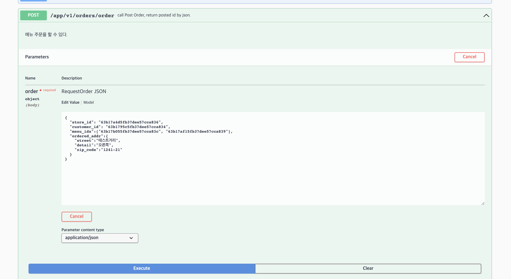

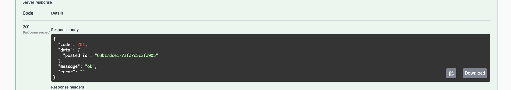


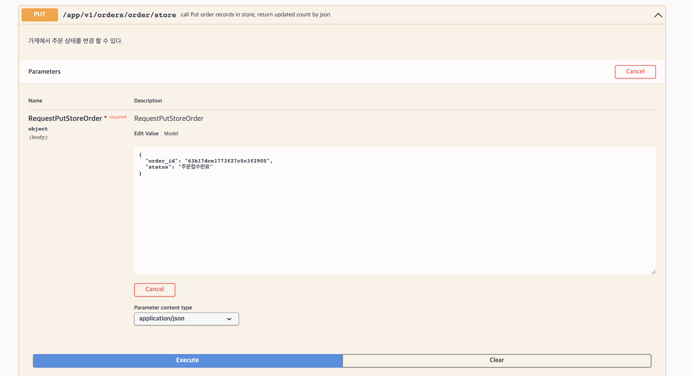

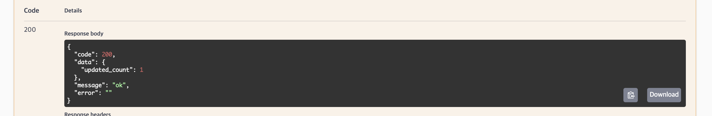

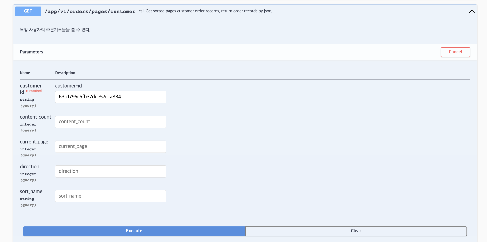

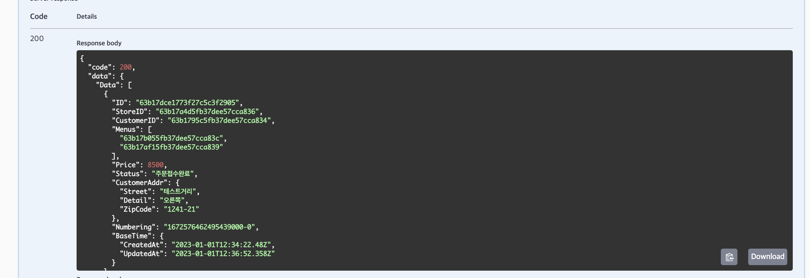

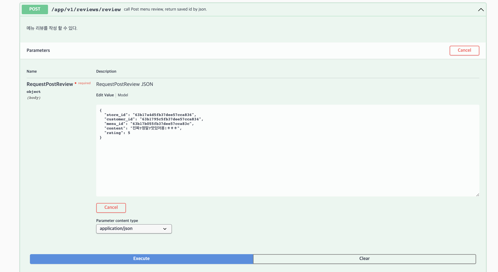

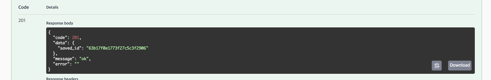


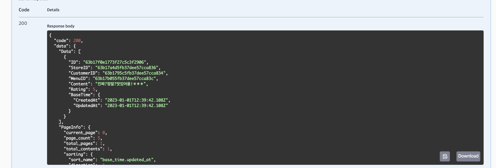

